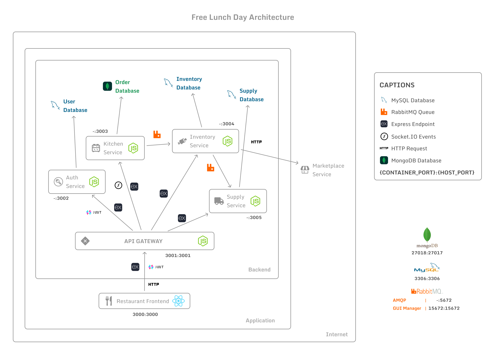

# Free Lunch Day App

Aplicación de gestión de una **jornada de almuerzos gratis**, construida utilizando una arquitectura de microservicios.

## Tecnologías utilizadas

## Diseño UI

* Figma.

### Bases de datos

* MySQL.
* MongoDB.

### Entornos de ejecución

* Node JS.
* Node JS con TypeScript.

### Cola de mensajería

* RabbitMQ.

### Contenerización

* Docker.
* Docker Compose.

### Librerías / Bibliotecas utilizadas

* Desarrollo frontend: **reactjs**.
* Driver para conectarse a bases de datos MongoDB: **mongoose**.
* Driver para conectarse a bases de datos MySQL: **mysql2**.
* Construcción de APIs. **express**.
* Proxy: **http-proxy-middleware**.
* Driver para conectarse a RabbitMQ: **ampqlib**.
* Peticiones HTTP: **axios**.
* Configuración de headers CORS: **cors**.
* Hot reloading: **nodemon**.
* Hot reloading con TypeScript: **ts-node-dev**.
* Compilación de TypeScript: **typescript**.
* Comunicación en tiempo real entre clientes y un servidor: **socket.io**

## Arquitectura de la aplicación

Se considero separar el backend en 4 microservicios:

* **Auth service:** Encargado de la autenticación.

* **Kitchen service:** Encargado de gestionar los pedidos de platos y guardar las recetas.

* **Inventory service:** Encargado de gestionar el inventario de ingredientes.

* **Supply service:** Encargado de gestionar el abastecimiento de ingredientes.



### Descripción del proceso en pseudocódigo

* Login de usuarios.

```txt
* [AUTH_SERVICE]

POST /auth/login

[AUTH_SERVICE]

SI (los ingredientes existe) ENTONCES
	+ Devuelve el token y los datos del usuario.
SINO
	+ Devuelve un código de error para dar feedback al usuario.

```

* Pedido de nuevo plato.

```txt

+ GET /kitchen/orders

* [KITCHEN_SERVICE]

+ Obtener una receta aleatoria.
+ Crear order en estado IN_PROGRESS.
+ Enviar petición de ingredientes al INVENTORY_SERVICE.

* [INVENTORY_SERVICE]

+ Buscar ingredientes en la base de datos.

SI (los ingredientes existe) ENTONCES

	+ Avisar al KITCHEN_SERVICE que los ingredientes han sido DISTRIBUIDOS.
	
SINO
	+ Enviar petición de abastecimiento.
	
	* [SUPPLY_SERVICE]
	
	MIENTRAS (no se cumplan los requerimientos)
		+ Pedir ingredientes a GET /farmers-market/buy
		+ Guardar petición de abastecimiento en el historial.	

	+ Avisar al microservicio de INVENTARIO que los ingredientes 	han sido ABASTECIDOS.

	* [INVENTORY_SERVICE]

	* Guardar cantidad sobrante de ingredientes.

* [KITCHEN_SERVICE]

+ Cambiar estado de order a DISPATCHED.
```

## Instrucciones

1. Construimos las imágenes.
```
docker-compose build
```
2. Iniciamos los contenedores.
```
docker-compose up
```

## Credenciales

Se puede iniciar sesión en la aplicación con estas credenciales:

```txt
username = mrivera
password = Mrivera_123
```

## Documentación de servicios

Documentación de servicios en Postman [Link de documentación en Postman](https://documenter.getpostman.com/view/14869061/2sA3XPE3ts).


## Consideraciones

* El puerto físico que se está mappeando para el contenedor de mongoose es el **27018**.